# AI-Powered Test Automation Framework - E2E Flow Diagram

## Complete Test Execution Flow with AI Triaging & Self-Healing

```mermaid
flowchart TD
    Start([User Triggers Test]) --> Queue[Test Orchestrator Queues Test]
    Queue --> Appium[Appium Starts Mobile App]
    Appium --> BasePage[BasePage.findElement Called]

    BasePage --> TryPrimary{Try Primary<br/>Locator}
    TryPrimary -->|Success| ExecuteTest[Execute Test Step]
    TryPrimary -->|Failed| TryFallback{Try Fallback<br/>Locators}

    TryFallback -->|Fallback Works| ReportHealing[Report Healing to Backend]
    TryFallback -->|All Failed| CaptureFailure[Capture Screenshot<br/>& Error Context]

    ReportHealing --> UpdateDB[(Store Healing<br/>Event in DB)]
    UpdateDB --> ExecuteTest

    ExecuteTest -->|Test Passes| Complete([Test Complete])
    ExecuteTest -->|Test Fails| CaptureFailure

    CaptureFailure --> SaveScreenshot[Save Screenshot<br/>to MinIO]
    SaveScreenshot --> CreateFailure[(Create Failure<br/>Record in DB)]
    CreateFailure --> TriggerAI[Trigger AI Analysis]

    TriggerAI --> ClaudeAPI[Send to Claude API]
    ClaudeAPI --> ClaudeInput[**Claude Receives:**<br/>- Screenshot base64<br/>- Error message<br/>- Stack trace<br/>- Locator definitions]

    ClaudeInput --> ClaudeAnalysis[**Claude Analyzes:**<br/>Vision + Text Analysis]

    ClaudeAnalysis --> ClaudeCategories{Categorize<br/>Failure}

    ClaudeCategories -->|ACTUAL_BUG| BugReport[Category: Actual Bug<br/>Confidence: XX%<br/>Evidence: App crash/error]
    ClaudeCategories -->|FLAKY_LOCATOR| LocatorIssue[Category: Flaky Locator<br/>Confidence: XX%<br/>Evidence: Element exists,<br/>ID changed]
    ClaudeCategories -->|TIMING_ISSUE| TimingIssue[Category: Timing Issue<br/>Confidence: XX%<br/>Evidence: Element loading]
    ClaudeCategories -->|ENVIRONMENTAL_ISSUE| EnvIssue[Category: Environmental<br/>Confidence: XX%<br/>Evidence: Network/system]

    BugReport --> SaveTriage[(Save Triage Report<br/>to DB)]
    LocatorIssue --> SaveTriage
    TimingIssue --> SaveTriage
    EnvIssue --> SaveTriage

    SaveTriage --> CheckCategory{Is Category<br/>FLAKY_LOCATOR?}

    CheckCategory -->|No| NotifyDash[Update Dashboard<br/>with Triage Report]
    CheckCategory -->|Yes| InitiateHealing[Initiate Self-Healing]

    InitiateHealing --> HealingStrategies{Apply Healing<br/>Strategies}

    HealingStrategies --> Strategy1[**Strategy 1:**<br/>Try Fallback Chain<br/>from locators.json]
    HealingStrategies --> Strategy2[**Strategy 2:**<br/>Ask Claude for<br/>Better Locator]
    HealingStrategies --> Strategy3[**Strategy 3:**<br/>Similarity Match<br/>Find Similar Elements]

    Strategy1 --> FoundLocator{Found Working<br/>Locator?}
    Strategy2 --> FoundLocator
    Strategy3 --> FoundLocator

    FoundLocator -->|No| ManualReview[Queue for<br/>Manual Review]
    FoundLocator -->|Yes| CalculateConf[Calculate Healing<br/>Confidence Score]

    CalculateConf --> ConfFactors[**Factors:**<br/>+ Base: 50%<br/>+ Strategy bonus: 0-25%<br/>+ Locator type: 5-15%<br/>+ Stability: 0-10%<br/>- Previous failures]

    ConfFactors --> FinalConf{Confidence >= 85%?}

    FinalConf -->|No| PendingApproval[Status: pending_approval<br/>Queue for Dashboard<br/>Review]
    FinalConf -->|Yes| AutoApply[Status: auto_applied<br/>Update locators.json]

    PendingApproval --> DashboardReview[Engineer Reviews<br/>on Dashboard]
    DashboardReview --> Approve{Approve<br/>Change?}
    Approve -->|No| Rejected[Status: rejected]
    Approve -->|Yes| ManualApply[Apply Change<br/>to locators.json]

    AutoApply --> UpdateLocators[**Update locators.json:**<br/>- New locator → primary<br/>- Old locator → fallback<br/>- Add healing metadata]
    ManualApply --> UpdateLocators

    UpdateLocators --> RetryTest[Retry Test with<br/>Healed Locator]
    RetryTest --> RetryResult{Test Passes?}

    RetryResult -->|Yes| HealingSuccess[Mark Healing<br/>as Successful]
    RetryResult -->|No| HealingFailed[Mark Healing<br/>as Failed]

    HealingSuccess --> UpdateDashStats[Update Dashboard:<br/>- Healing count +1<br/>- Success rate<br/>- Time saved]
    HealingFailed --> UpdateDashStats
    ManualReview --> UpdateDashStats
    NotifyDash --> UpdateDashStats
    Rejected --> UpdateDashStats

    UpdateDashStats --> DashboardView[**Dashboard Shows:**<br/>- Test run summary<br/>- Triage reports<br/>- Healing statistics<br/>- Approval queue]

    DashboardView --> Complete

    style ClaudeAnalysis fill:#ff6b6b
    style AutoApply fill:#51cf66
    style UpdateLocators fill:#51cf66
    style HealingSuccess fill:#51cf66
    style BugReport fill:#ffd43b
    style LocatorIssue fill:#74c0fc
    style SaveTriage fill:#74c0fc
    style DashboardView fill:#a78bfa
```



## Key Components & Flow Details

### 1. Test Execution Layer
```
User → Test Orchestrator → Appium → Mobile App
                    ↓
               BasePage (Self-Healing Locator Engine)
```

**Logs Example:**
```
[INFO] TestOrchestrator: Starting test run TR-20260113-001
[INFO] MobileTestRunner: Launching app com.example.app
[INFO] BasePage: Finding element 'loginPage.username'
[DEBUG] BasePage: Trying primary locator: id="username_input"
[ERROR] BasePage: Primary locator failed - NoSuchElementError
[INFO] BasePage: Initiating fallback chain (2 fallbacks available)
[DEBUG] BasePage: Trying fallback #1: xpath="//EditText[@content-desc='Username']"
[SUCCESS] BasePage: Fallback #1 succeeded! Element found.
[INFO] BasePage: Reporting healing event to backend
```

### 2. Failure Detection & Capture
```
Test Fails → Capture Screenshot → Save to MinIO → Create Failure Record
```

**Logs Example:**
```
[ERROR] Test: login_test.ts:45 - Element not found
[INFO] FailureCapture: Taking screenshot...
[INFO] ScreenshotStorage: Uploading to MinIO bucket 'test-artifacts'
[INFO] ScreenshotStorage: Saved as failure-TR-001-20260113-215930.png
[INFO] Database: Created failure record F-20260113-001
```

### 3. AI Triaging with Claude
```
Failure → Send to Claude API → Analyze (Vision + Text) → Categorize → Store Report
```

**Claude API Request Example:**
```json
{
  "model": "claude-3-5-sonnet-20241022",
  "max_tokens": 2000,
  "messages": [{
    "role": "user",
    "content": [
      {
        "type": "text",
        "text": "Analyze this test failure:\nTest: Login with valid credentials\nPlatform: Android\nError: NoSuchElementError: Element with id 'username_input' not found\n\nCategorize as: ACTUAL_BUG | FLAKY_LOCATOR | TIMING_ISSUE | ENVIRONMENTAL_ISSUE\nProvide confidence (0-100), reasoning, evidence, and actions."
      },
      {
        "type": "image",
        "source": {
          "type": "base64",
          "media_type": "image/png",
          "data": "iVBORw0KGgoAAAANS..."
        }
      }
    ]
  }]
}
```

**Claude API Response Example:**
```json
{
  "category": "FLAKY_LOCATOR",
  "confidence": 92,
  "bugProbability": 8,
  "reasoning": "The screenshot shows a functional login screen with the username input field clearly visible and accessible. The error indicates the element ID changed from 'username_input' to possibly 'user_name_field' or similar. The UI itself shows no crash, error dialogs, or visual bugs. This is a locator maintenance issue, not an application bug.",
  "evidencePoints": [
    "UI element is visible and appears functional in screenshot",
    "No error dialogs or crash indicators present",
    "Element exists but under different ID (common after app updates)",
    "Fallback locator successfully found the same element"
  ],
  "suggestedActions": [
    "Update primary locator to the working fallback",
    "Use accessibility IDs instead of resource IDs for better stability",
    "Add current ID as fallback for rollback scenarios",
    "Verify with dev team if ID naming convention changed"
  ]
}
```

**Logs Example:**
```
[INFO] FailureAnalyzer: Analyzing failure F-20260113-001
[DEBUG] FailureAnalyzer: Preparing Claude API request
[DEBUG] ClaudeClient: Sending request with screenshot (245KB base64)
[INFO] ClaudeClient: Response received in 2.3s
[INFO] FailureAnalyzer: Category=FLAKY_LOCATOR, Confidence=92%
[INFO] Database: Created triage report TR-20260113-001
```

### 4. Self-Healing Engine
```
FLAKY_LOCATOR detected → Apply Strategies → Find Working Locator →
Calculate Confidence → Auto-Apply (if confident) OR Queue for Review
```

**Healing Strategies:**

**Strategy 1: Fallback Chain**
```typescript
// locators.json
{
  "loginPage": {
    "username": {
      "primary": { "type": "id", "value": "username_input" }, // FAILS
      "fallbacks": [
        { "type": "xpath", "value": "//EditText[@content-desc='Username']" }, // WORKS!
        { "type": "xpath", "value": "//EditText[contains(@text, 'Username')]" }
      ]
    }
  }
}
```

**Strategy 2: AI-Suggested Locator**
```
Ask Claude: "Based on this screenshot and failed locator 'id=username_input',
suggest a better, more stable locator for this element."

Claude Response: "Use accessibility ID: @content-desc='Username'
or XPath: //EditText[@content-desc='Username']"
```

**Strategy 3: Similarity Match**
```
Find elements with similar:
- Position on screen
- Size dimensions
- Text content
- Element type
```

**Logs Example:**
```
[INFO] LocatorHealer: Starting healing for loginPage.username
[INFO] LocatorHealer: Strategy 1 - Fallback Chain
[SUCCESS] LocatorHealer: Fallback #1 succeeded!
[INFO] LocatorHealer: Calculating confidence score
[DEBUG] Confidence Factors:
  Base confidence: 50%
  + Strategy bonus (fallback_chain): 25%
  + Locator type (xpath): 5%
  + Element stability (85%): 9%
  - Previous failures (0): 0%
  = Total: 89%
[INFO] LocatorHealer: Confidence 89% >= Threshold 85%
[INFO] LocatorHealer: Decision: AUTO_APPLY
[INFO] LocatorHealer: Updating locators.json
[INFO] FileSystem: locators.json updated successfully
[INFO] LocatorHealer: Retrying test with healed locator
[SUCCESS] Test: login_test.ts - Test passed with healed locator
```

### 5. Locator Update Example

**Before Healing:**
```json
{
  "loginPage": {
    "username": {
      "primary": {
        "type": "id",
        "value": "username_input"
      },
      "fallbacks": [
        { "type": "xpath", "value": "//EditText[@content-desc='Username']" }
      ],
      "metadata": {
        "lastVerified": "2026-01-10",
        "healingHistory": []
      }
    }
  }
}
```

**After Healing (Auto-Applied):**
```json
{
  "loginPage": {
    "username": {
      "primary": {
        "type": "xpath",
        "value": "//EditText[@content-desc='Username']"
      },
      "fallbacks": [
        { "type": "id", "value": "username_input" }
      ],
      "metadata": {
        "lastVerified": "2026-01-13",
        "healingHistory": [
          {
            "date": "2026-01-13T21:59:30Z",
            "reason": "Primary failed, fallback succeeded",
            "oldLocator": { "type": "id", "value": "username_input" },
            "newLocator": { "type": "xpath", "value": "//EditText[@content-desc='Username']" },
            "strategy": "fallback_chain",
            "confidence": 89,
            "autoApplied": true
          }
        ]
      }
    }
  }
}
```

### 6. Dashboard Real-Time Updates

**WebSocket Events:**
```
[WS] test_started { runId: "TR-001", testName: "Login Test" }
[WS] test_failed { runId: "TR-001", failureId: "F-001" }
[WS] triage_completed { triageId: "TR-001", category: "FLAKY_LOCATOR" }
[WS] healing_started { changeId: "LC-001", element: "loginPage.username" }
[WS] healing_completed { changeId: "LC-001", status: "auto_applied" }
[WS] test_passed { runId: "TR-001", healingApplied: true }
```

**Dashboard Views:**

1. **Test Runs Dashboard:**
```
┌─────────────────────────────────────────────────┐
│  Test Automation Dashboard                      │
├─────────────────────────────────────────────────┤
│  Total Runs: 47    Pass Rate: 94.3%            │
│  AI Triaged: 12    Self-Healed: 8              │
│                                                  │
│  Failure Breakdown:                             │
│    Actual Bugs: 3 (25%)                         │
│    Flaky Locators: 7 (58%)                      │
│    Timing Issues: 2 (17%)                       │
│                                                  │
│  Self-Healing Status:                           │
│    Auto-Applied: 6 (75%)                        │
│    Pending Review: 2 (25%)                      │
│    Success Rate: 96%                            │
│    Time Saved: 23.5 hours                       │
└─────────────────────────────────────────────────┘
```

2. **Triage Reports View:**
```
┌─────────────────────────────────────────────────────────────┐
│  🤖 AI Triage Report - F-20260113-001                       │
├─────────────────────────────────────────────────────────────┤
│  Test: Login with valid credentials                         │
│  Platform: Android                                          │
│  Failed At: 2026-01-13 21:59:28                            │
│                                                              │
│  Category: FLAKY_LOCATOR                                    │
│  Confidence: 92%    Bug Probability: 8%                     │
│                                                              │
│  Reasoning:                                                  │
│  "The screenshot shows a functional login screen with       │
│   the username input field clearly visible. The error       │
│   indicates the element ID changed, but the element         │
│   itself exists and is functional."                         │
│                                                              │
│  Evidence:                                                   │
│  • UI element is visible and functional                     │
│  • No error dialogs or crashes present                      │
│  • Fallback locator successfully found element              │
│                                                              │
│  Actions Taken:                                              │
│  ✅ Self-healing initiated                                   │
│  ✅ Locator updated automatically (confidence 89%)          │
│  ✅ Test retried and passed                                 │
└─────────────────────────────────────────────────────────────┘
```

3. **Self-Healing Approval Queue:**
```
┌─────────────────────────────────────────────────────────────┐
│  🔧 Pending Locator Changes (Manual Review Required)        │
├─────────────────────────────────────────────────────────────┤
│  LC-20260113-002  •  homePage.searchButton  •  Conf: 72%   │
│  ────────────────────────────────────────────────────────── │
│  OLD: id="search_btn"                                       │
│  NEW: xpath="//Button[@text='Search']"                     │
│  Strategy: similarity_match                                 │
│                                                              │
│  Reason: Low confidence due to similarity match strategy    │
│  [Approve]  [Reject]  [View Screenshot]                    │
└─────────────────────────────────────────────────────────────┘
```

## Time & Value Metrics

**Traditional Approach (Manual):**
```
Test Fails → Engineer Notified → Investigate (15 min) →
Fix Locator (5 min) → Commit & Push (5 min) → Re-run Test (5 min)
= 30 minutes per failure
```

**AI-Powered Framework (Automated):**
```
Test Fails → AI Analyzes (2 sec) → Self-Healing (1 sec) →
Auto-Apply (<1 sec) → Retry Test (5 sec)
= ~8 seconds total
```

**Time Saved:** 29 minutes 52 seconds per failure (99.6% faster)

**Value Over 1 Month:**
- Locator failures prevented: ~40
- Engineer hours saved: ~20 hours
- Zero test maintenance required
- Tests always up-to-date with latest app

## Summary

This E2E flow demonstrates:
1. **Self-healing locators** that automatically adapt to app changes
2. **AI-powered triaging** that distinguishes real bugs from flaky tests
3. **Confidence-based automation** that only auto-applies high-confidence changes
4. **Human oversight** for low-confidence changes via dashboard
5. **Complete transparency** with detailed logs, reasoning, and audit trails
6. **Zero-maintenance testing** where tests fix themselves

All of this runs automatically with zero engineer intervention for high-confidence changes, while still providing human review capabilities for uncertain scenarios.
